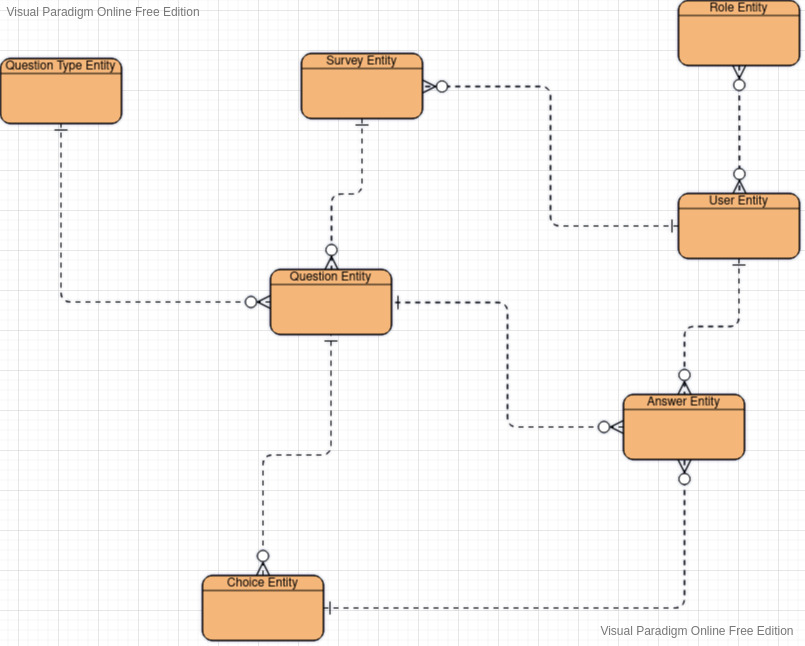

## A java & spring survey application 
A software similar to stackoverflow survey just for testing 
## How Run Application
create user and postgres database based on config user password etc ...
You can use these [instructions](https://medium.com/coding-blocks/creating-user-database-and-adding-access-on-postgresql-8bfcd2f4a91e
)
```shell
git clone https://github.com/robatipoor/survey
cd survey
./mvn spring-boot:run
# open browser 
# go to http://127.0.0.1:8080/swagger-ui/index.html
```

## Basic Usage API
```shell
# ping request
curl -X 'GET' \
  'http://127.0.0.1:8080/api/v1/app/ping' \
  -H 'accept: */*'
# login user admin request and get jwt token
curl -X 'POST' \
  'http://127.0.0.1:8080/api/v1/user/login' \
  -H 'accept: */*' \
  -H 'Content-Type: application/json' \
  -d '{
  "username_or_email": "admin",
  "password": "admin"
}'
# create new survey and get survey slug
curl -X 'POST' \
  'http://127.0.0.1:8080/api/v1/survey/create' \
  -H 'accept: */*' \
  -H 'Authorization: Bearer jwtSample' \
  -H 'Content-Type: application/json' \
  -d '{
  "expire_days": 0,
  "title": "survey title",
  "questions": [
    {
      "choices": [
        {
          "number": 0,
          "content": "option 1"
        },
        {
          "number": 1,
          "content": "option 2"
        }
      ],
      "content": "content question"
    }
  ]
}'
# create survey link and share to users
# {base-url}/api/v1/question/{survey-slug}
# users can submit survey with sample request
curl -X 'POST' \
  'http://127.0.0.1:8080/api/v1/survey/submit/{survey-slug}' \
  -H 'accept: */*' \
  -H 'Authorization: Bearer jwtSample' \
  -H 'Content-Type: application/json' \
  -d '{
  "answers": [
    {
      "question_id": sampleId,
      "choice_id": sampleId
    },
    ...
  ]
}'
# admin user can see result of survey with api
curl -X 'GET' \
  'http://127.0.0.1:8080/api/v1/survey/result/{survey-slug}?page=0&size=1' \
  -H 'accept: */*' \
  -H 'Authorization: Bearer jwtSample'

```
## Getting Started Development
```shell
./mvn clean package 
## install git code format hook
./mvnw git-code-format:install-hooks
```
## Entity Relationship Diagram



## TODO list
1. for security reason we can use uuid instead of sequence number id
2. add more unit and integrate test 
3. add more exception handler
4. add docker file