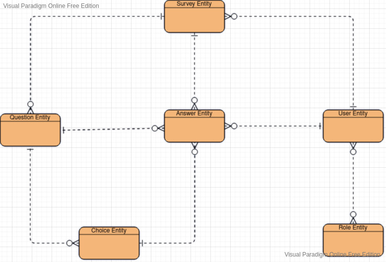

## A java & spring survey application 

## Install Application
// TODO

## Basic Usage
// TODO

http://127.0.0.1:8080/swagger-ui/index.html
## Getting Started Development
```shell
./mvn clean package 
## install git code format hook
./mvnw git-code-format:install-hooks
```
## Entity Relationship Diagram



## TODO list
1 . for security reason we can use uuid instead of sequence number id